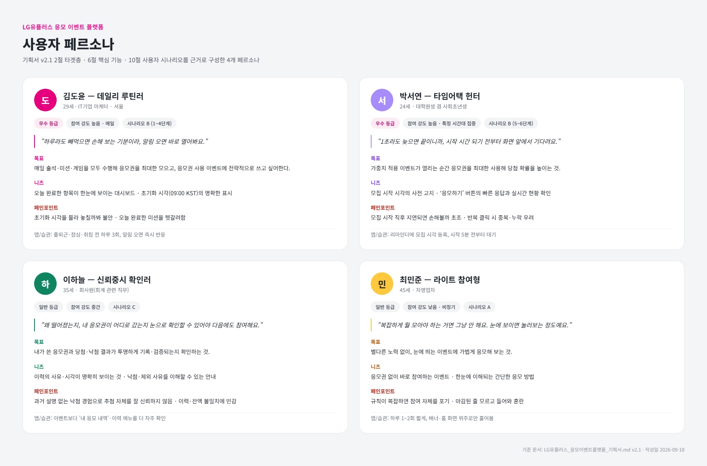

# 제품 맥락 (product-context)

> 원 기획서(노션 'LG유플러스 응모 이벤트 플랫폼' 종합 기획 문서, 2026-09-18 편집본)에서 공용 명세 저장소 `getddo-spec`에 없는 기획 맥락만 발췌한 문서다.
> **기능·도메인 정책의 기준은 `../getddo-spec/`이다.** 아래 시나리오·비기능에 정책 관련 표현이 spec과 다르면 spec을 따른다.
>
> 기획서 원문 이후 spec에서 확정·변경된 주요 사항 (이 문서의 원문 표현과 다를 수 있음):
>
> - 업무 기준일·기준월은 KST(매일·매월 1일 00:00 KST 초기화). 원문의 "00:00 UTC 초기화"는 폐기됨
> - 최초 추첨·발표는 마감 + 5분에 자동 진행 (관리자 수동 추첨·발표 승인 폐지) — `getddo-spec` ADR-009
> - 일반 가중치 적용 이벤트의 응모권 사용은 사용자당 이벤트별 누적 최대 5장 — ADR-010
> - 발표 결과는 마스킹한 이름·전화번호·이메일로 표시 (닉네임 정책 대체)
> - 임직원 여부는 응모 제한 조건으로 사용하지 않음 (관리자만 응모 불가)

## 프로젝트 목표

**LG유플러스 사이트와 결합**하여, LG유플러스 멤버십 가입자를 대상으로 한 응모 이벤트 플랫폼. 사용자는 출석·미션·게임으로 응모권을 모으고, 이를 응모권 사용 이벤트에 차감해 응모하거나 응모권 미사용 이벤트에 자유롭게 응모하며, 모든 추첨 과정은 관리자가 사후에 재현·검증할 수 있는 구조로 설계한다.

## 타겟층

**LG유플러스 기존 가입자 전체**를 핵심 타겟으로 한다. 별도의 신규 회원 모집이나 특정 등급 고객에 한정하지 않고, 이미 유플러스 서비스를 이용 중인 모든 멤버십 등급의 가입자가 응모 대상이다. 이벤트별 응모 자격(멤버십 등급 등)은 개별 이벤트 설정에서 유연하게 제한할 수 있으나, 서비스 자체의 잠재 사용자군은 전체 가입자로 정의한다.

- 앱/웹을 통해 일상적으로 출석·미션·게임에 참여하며 꾸준히 응모권을 모으는 데 익숙한 사용자
- 특정 시간대에 열리는 한정 이벤트(응모권 사용 이벤트)에 실시간으로 응모하는 사용자
- 추첨 결과와 당첨 과정의 신뢰성을 중요하게 여기는 사용자

## 문제 정의

기존 이벤트 응모·추첨 서비스는 **당첨자가 어떻게, 어떤 기준으로 선정되었는지 사용자가 확인할 방법이 없다는 불투명성 문제**를 안고 있다. 추첨 로직이 공개되지 않고, 같은 조건으로 다시 추첨했을 때 같은 결과가 나온다는 것을 아무도 검증할 수 없기 때문에, 결과 발표 이후 "조작된 것 아니냐"는 불신이 반복적으로 제기된다. 또한 응모권(포인트성 재화)의 지급·차감 내역이 불투명하게 관리되는 경우, 보유량과 이력이 어긋나는 문제도 사용자 신뢰를 해치는 요인이 된다.

해결 방안으로 **"검증 가능한 공정한 추첨"**을 핵심 설계 원칙으로 삼는다.

- 추첨에 사용된 응모자 명단, 응모권 수, 가중치, 조건을 스냅샷으로 별도 보관해 추첨 시점의 상태를 그대로 재현할 수 있게 한다
- 추첨 알고리즘에 필요한 시드(또는 추첨 키), 입력 순서, 버전 등 재현 자료를 함께 보존해, 관리자가 동일 입력·조건으로 결과와 당첨 순서를 재현하고 원본과 일치하는지 확인할 수 있게 한다
- 응모권의 지급·차감 이력은 수정·삭제 없이 누적 기록하며, 이력 합계와 현재 보유 응모권 수가 항상 일치하도록 설계해 "내가 왜 이 응모권을 못 쓰게 됐는지" 같은 불신 요소를 제거한다
- 결과 발표 전에는 철저히 비공개로 유지하고, 발표 시점에는 마스킹된 당첨자 명단과 당첨 경품을 투명하게 공개한다
- 어뷰징이 탐지되더라도 자동으로 배제하지 않고, 관리자가 사유를 확인·기록한 뒤 결정하도록 해 임의성을 줄인다
- 발표 후 자격 미달이나 어뷰징이 확인되면, 해당 당첨만 취소하고 재추첨하되 이력과 최초 추첨과의 연결 관계를 보존해 사후 검증이 가능하게 한다

## 유사 서비스 분석

| 대표 서비스                                     | 특징                                                                                                                 | 한계                                                                                                 |
| ----------------------------------------------- | -------------------------------------------------------------------------------------------------------------------- | ---------------------------------------------------------------------------------------------------- |
| **SKT T멤버십** (통신사 멤버십 앱)              | 등급별 혜택 차등 제공, 'VIP 찬스'·'VIP only' 등 상위 등급 전용 혜택, 특정 상품 구매 고객 대상 래플(추첨) 이벤트 운영 | 추첨·응모는 부가 혜택 중 하나로만 제공되며, 추첨 로직·선정 기준이 비공개라 결과를 검증할 방법이 없음 |
| **캐시워크** (리워드·출석 게이미피케이션 앱)    | 출석·걸음수 보상 세분화, '캐시로또' 회차별 추첨                                                                      | 복권형 구조로 체감 당첨 확률이 낮고, 추첨 근거가 공개되지 않아 사후 검증 불가                        |
| **이벤터스(EventUs)** (응모·이벤트 전문 플랫폼) | 강의·세미나·행사 등록과 응모를 아우르는 범용 이벤트 관리 SaaS                                                        | 범용 도구라 멤버십 등급 연동이 없고, 출석·미션형 반복 참여 유도 요소가 약함                          |
| **커머스 플랫폼 경품 이벤트**                   | 구매·리뷰 등 특정 행동 조건으로 추첨 응모, 짧은 주기로 반복 운영                                                     | 구매·결제 연계라 무료 참여 동선이 약하고, 당첨 선정 근거 비공개로 사후 검증 불가                     |

공통적으로, 위 서비스들은 **혜택·참여 유도 장치는 정교하지만 추첨·선정 과정의 투명성과 사후 검증 가능성은 사용자에게 노출하지 않는다**는 공백이 있다. 본 프로젝트는 포인트·응모권을 돈에 준해 다루는 **커머스형 경품 이벤트**를 소재로 하되, 구매·결제 연계 없이 출석·미션·게임 기반의 무료 참여 구조를 택했다는 점에서 구별된다.

## 차별점

이 과제가 다루는 것은 궁극적으로 포인트·응모권처럼 **돈에 준해 다뤄야 하는 데이터의 정합성**이다. 백엔드는 수정·삭제 없는 이력 설계와 재현·사후 검증이 가능한 추첨 설계를, 프론트엔드는 이벤트 참여 화면부터 운영자용 백오피스까지 이어지는 실무형 서비스 UI를 함께 구현한다.

| 차별점                           | 설명                                                                                                                                                                                                                                     | 기존 서비스 대비 효과                                                                                                            |
| -------------------------------- | ---------------------------------------------------------------------------------------------------------------------------------------------------------------------------------------------------------------------------------------- | -------------------------------------------------------------------------------------------------------------------------------- |
| 검증 가능한 공정한 추첨 시스템   | 추첨 시점의 응모자 명단·응모권 수·가중치·조건을 스냅샷으로 보존하고, 시드·입력순서 등 재현 자료를 함께 기록해 관리자가 동일 조건으로 결과를 재현·검증할 수 있다. 발표 후 문제가 확인되면 당첨 취소·재추첨 이력도 최초 추첨과 연결해 보존 | 추첨 로직이 블랙박스로 남는 기존 서비스와 달리 "왜 이 사람이 당첨됐는가"에 대한 사후 검증이 가능해 결과 발표의 신뢰도가 높아진다 |
| 정합성이 보장된 응모권 이력 관리 | 지급·차감 이력을 수정·삭제 없이 누적 기록하고, 이력 합계와 보유 응모권 수가 항상 일치하도록 설계한다. 이벤트 취소 시에도 반환 이력을 별도로 추가해 잔액과 함께 반영                                                                      | 사용자가 응모권 변동 내역을 이력 그대로 신뢰할 수 있고, 문의·분쟁 시 근거 있는 대응이 가능하다                                   |
| 이벤트 유형별 맞춤 응모 방식     | 응모권 없이 응모만으로 완료되는 이벤트와, 특정 시간대에만 응모권을 차감해 응모하는 이벤트(가중치 적용/미적용)를 구분해 제공                                                                                                              | 단순 응모형과 한정 시간 집중형 이벤트를 모두 아우른다                                                                            |

## 기술 스택

- **Front end**: TypeScript, React, Vite, React Router, TanStack Query, Zustand, Redux Toolkit, TailwindCSS, shadcn/ui, TanStack Table, react-day-picker, React Hook Form, Zod, GSAP, Framer Motion, canvas-confetti, MSW, Vitest, React Testing Library
- **Back end**: Java 21, Spring Boot, Spring MVC, Spring Data JPA, Hibernate, MySQL, Flyway, Gradle
- BE는 Spring 기반 자체 API 서버 + MySQL 구조. 인증·권한 제어·추첨 로직은 애플리케이션 레이어에서 구현하며 스키마 이력은 Flyway로 관리한다.

## 사용자 시나리오 및 유저플로우

> 원문 시나리오 중 추첨·발표 관련 단계는 spec ADR-009(마감 + 5분 자동 발표)로 변경됐다. 아래 "수동 추첨", "관리자 발표 승인" 표현은 현재 정책이 아니며, 정책 기준은 `../getddo-spec/02-domain/drawing.md`를 따른다.

### 사용자(응모자) 시나리오

**시나리오 A — 응모권 미사용 이벤트에 응모하기**

1. 가상 사용자를 선택해 로그인 화면을 통과한다.
2. 홈 화면에서 배너 또는 이벤트 목록을 통해 진행 중인 응모권 미사용 이벤트를 발견한다.
3. 이벤트 상세에서 응모 기간·경품·당첨 인원·응모 자격(멤버십 등급)을 확인한다.
4. 응모 자격을 충족하면 '응모하기'를 눌러 경품 선택 없이 이벤트 자체에 응모한다 (응모권 차감 없음).
5. 내 응모 내역에서 응모 처리 결과(접수 완료)를 확인한다.
6. 마감·검토·추첨 이후, 결과 발표 알림을 받고 당첨 여부와 경품을 확인한다.

**시나리오 B — 응모권을 모아 응모권 사용 이벤트에 응모하기**

1. 기본 출석(하루 1회)으로 응모권을 1장 지급받는다.
2. 미션(설문·퀴즈)과 연속 출석을 수행해 추가 응모권을 지급받는다.
3. 게임을 플레이해 점수를 기록하고, 하루 1회 한도 내에서 응모권을 지급받는다.
4. 내 응모권 화면에서 보유 수량과 지급·차감 이력을 확인한다.
5. 모집 시작 시각에 맞춰 응모권 사용 이벤트 상세에 진입한다.
6. 가중치 적용 이벤트라면 '응모하기'를 여러 번 눌러 응모권을 그때그때 차감하며 응모를 누적한다 (누적 최대 5장). 가중치 미적용 이벤트라면 1회만 응모하고 응모권 1장이 차감된다.
7. 모집 마감 후 5분 검토 시간을 거쳐 자동으로 결과가 발표되고, 알림함에서 진행 상황을 확인한다.

**시나리오 C — 제외·낙첨 등 예외 상황**

- 어뷰징으로 추첨 대상에서 제외된 경우: 본인에게만 제외 사실과 사유가 안내되며, 일반 낙첨과 구분된 문구로 표시된다.
- 유효 추첨 대상자가 없어 이벤트가 '응모자 없음' 또는 '추첨 대상자 없음'으로 종료된 경우: 해당 상태가 이벤트 상세·내 응모 내역에 표시된다.
- 이벤트가 중단·취소된 경우: 상태 표시와 함께(취소 시) 차감된 응모권이 반환 이력으로 응모권 내역에 나타난다.

### 관리자 시나리오

**시나리오 D — 이벤트 개설부터 발표까지**

1. 백오피스에서 이벤트를 등록한다 (이름·설명·이미지·응모 기간·경품·당첨 인원·멤버십 등급 조건·응모권 사용 여부·가중치 적용 여부·모집 시작/마감 시각).
2. 시작 전 상태에서 설정을 검토·수정한다.
3. 진행 중에는 실시간 응모 현황(응모자 수·응모 건수·차감된 응모권 수)을 모니터링한다.
4. 마감 후 5분의 검토 시간에 어뷰징 탐지 건을 처리해 '참여 허용' 또는 '추첨 대상 제외'를 결정하고 사유를 기록한다.
5. 마감 시각 + 5분에 시스템이 자동으로 최초 추첨 결과를 발표한다 (별도 승인 없음).
6. 발표와 동시에 응모자 전원에게 비동기로 결과 확인 알림이 생성된다.

**시나리오 E — 발표 후 재추첨**

1. 발표 후 특정 당첨자의 자격 미달 또는 어뷰징이 확인된다.
2. 관리자가 사유를 입력하고 해당 당첨만 취소한다 (다른 당첨자는 유지).
3. 재추첨을 수동으로 실행하며, 결과는 최초 추첨 이력과 연결되어 보존된다.
4. 관리자가 재추첨 결과를 확인한 후 공개 당첨자 명단을 갱신하고, 당첨 취소자와 새 당첨자에게만 변경 알림이 생성된다.

### 유저 플로우 다이어그램 (텍스트)

**사용자 플로우**

```text
[로그인 화면: 가상 사용자 선택]
        │
        ▼
     [홈 화면] ──(배너 클릭)──▶ [이벤트 상세]
        │                              │
 ┌──────┼───────────┐                  │
 ▼      ▼            ▼                  │
[출석] [미션] [게임] ──▶ [응모권 지급] ──┘
                                        │
                         ┌──────────────┴───────────────┐
                         ▼                               ▼
              [응모권 미사용 이벤트 응모]        [응모권 사용 이벤트 응모]
              (경품 선택 없음·차감 없음)          (모집 시간 내 응모권 차감)
                         │                               │
                         └──────────────┬────────────────┘
                                        ▼
                              [내 응모 내역 확인]
                                        │
                                        ▼
                         [마감 → 5분 검토 카운트다운 → 자동 발표]
                                        │
                                        ▼
                       [알림함: 결과 확인 알림] → [당첨/낙첨/제외 확인]
```

**관리자 플로우**

```text
[이벤트 등록] → [진행 중 모니터링(실시간 현황)] → [마감]
                                                    │
                                     ┌──────────────┴───────────────┐
                                     ▼                               ▼
                          [어뷰징 검토: 참여허용/제외]      [유효 응모 처리 확인]
                                     └──────────────┬───────────────┘
                                                    ▼
                                        [추첨 대상 명단 확정]
                                                    │
                                                    ▼
                                    [마감 + 5분: 자동 최초 발표 + 알림 비동기 생성]
                                                    │
                                          (사후 문제 발견 시)
                                                    ▼
                                [당첨 취소 → 재추첨 → 관리자 확인 후 명단 갱신]
```

화면 단위 와이어프레임·IA(정보구조도)는 별도 문서로 작성할지 팀이 정해야 하는 미결정 항목이다.

## 사용자 페르소나

> 기획서 "타겟층"의 세 가지 사용자 유형(일상 참여형·한정 이벤트 실시간형·신뢰 중시형)을 구체화하고, 서비스 참여 강도가 낮은 라이트 유저 유형을 더해 총 **4개 페르소나**로 구성했다. 페르소나 이름은 가상 인물이다.

### 페르소나 한눈에 보기

| 페르소나                 | 한 줄 요약                                                        | 참여 강도              | 멤버십 등급 | 연결 시나리오        |
| ------------------------ | ----------------------------------------------------------------- | ---------------------- | ----------- | -------------------- |
| 김도윤 — 데일리 루틴러   | 매일 출석·미션·게임을 빠짐없이 수행해 응모권을 최대한 모은다      | 높음(매일)             | 우수        | 시나리오 B (1~4단계) |
| 박서연 — 타임어택 헌터   | 한정 모집 시간에 맞춰 실시간으로 응모권 사용 이벤트에 몰입한다    | 높음(특정 시간대 집중) | 우수        | 시나리오 B (5~6단계) |
| 이하늘 — 신뢰중시 확인러 | 응모권 이력과 추첨 결과의 투명성·검증 가능성을 가장 중요하게 본다 | 중간                   | 일반        | 시나리오 C           |
| 최민준 — 라이트 참여형   | 배너에 눈에 띄는 이벤트에만 가볍게, 가끔 응모한다                 | 낮음(비정기)           | 일반        | 시나리오 A           |



### 1. 김도윤 — 데일리 루틴러

**기본 정보**

- 29세, IT기업 마케터, 서울 거주, 유플러스 **우수 등급**, iPhone 사용
- 출퇴근 시간대에 앱을 습관적으로 열어보는 성향

**IT/앱 사용 습관**
알림을 켜두고 오는 대로 바로 반응하는 편이며, 아침 출근길·점심시간·잠들기 전 하루 세 번 정도 앱을 연다. 루틴처럼 반복되는 행동(출석·간단한 미션)에 익숙하고 거부감이 없다.

**목표(Goals)**
하루도 빠짐없이 출석·미션·게임을 모두 수행해서 매일 최대한 많은 응모권을 모으는 것. 모은 응모권을 응모권 사용 이벤트에 전략적으로 쓰고 싶어한다.

**니즈(Needs)**

- 오늘 무엇을 완료했고 무엇을 안 했는지 한눈에 보이는 대시보드
- 출석·게임 보상의 초기화 시각이 화면에 명확히 표시되는 것 (매일 00:00 KST)
- 응모권 지급 이력을 날짜별로 빠르게 훑어볼 수 있는 화면

**페인포인트(Pain points)**

- 초기화 기준 시각을 몰라서 자정 직후 출석했다가 인정이 안 될까봐 불안해한다.
- 오늘 이미 게임 보상을 받았는지, 미션을 완료했는지 헷갈릴 때가 있다.

**대표 시나리오**
시나리오 B의 1~4단계(기본 출석 → 미션 → 게임 → 응모권 조회)를 거의 매일 반복 수행한다.

**인용구**

> "하루라도 빼먹으면 손해 보는 기분이라, 알림 오면 바로 열어봐요."

### 2. 박서연 — 타임어택 헌터

**기본 정보**

- 24세, 대학원생 겸 사회초년생, 유플러스 **우수 등급**, Android 사용
- 시간에 민감하고 경쟁적인 성향, 리마인더 앱을 적극 활용

**IT/앱 사용 습관**
여러 캘린더·리마인더 앱에 이벤트 모집 시작 시각을 미리 등록해두고, 시작 5분 전부터 화면 앞에서 대기한다. 네트워크 반응 속도에 민감하고, 버튼 반응이 느리면 바로 재시도한다.

**목표(Goals)**
가중치 적용 이벤트가 열리는 순간 보유한 응모권을 최대한 많이 사용해 당첨 확률을 높이는 것.

**니즈(Needs)**

- 모집 시작 정확한 시각의 사전 고지
- '응모하기' 버튼의 빠른 응답과 즉각적인 처리 결과 피드백
- 지금까지 내가 사용한 응모권 수와 총 응모 현황(실시간 응모 현황)의 실시간 확인

**페인포인트(Pain points)**

- 모집 시작 직후 서버가 느리면 다른 응모자보다 늦게 응모하게 될까봐 초조해한다.
- 반복 클릭 중 같은 요청이 중복 차감될까봐(또는 반대로 응모가 하나도 안 될까봐) 불안해한다.

**대표 시나리오**
시나리오 B의 5~6단계(모집 시작 시각에 맞춰 진입, '응모하기' 반복 클릭으로 응모 누적)를 가장 적극적으로 수행한다.

**인용구**

> "1초라도 늦으면 끝이니까, 시작 시간 되기 전부터 화면 앞에서 기다려요."

### 3. 이하늘 — 신뢰중시 확인러

**기본 정보**

- 35세, 회사원(회계 관련 직무), 유플러스 **일반 등급**
- 꼼꼼하고 기록을 신뢰하는 성향, 숫자가 안 맞으면 바로 확인하는 편

**IT/앱 사용 습관**
이벤트 참여보다 '내 응모 내역'·'응모권 이력' 같은 조회 메뉴를 더 자주 들어간다. 화면에 나온 숫자와 자신이 기억하는 내용이 다르면 캡처해서 남겨두는 습관이 있다.

**목표(Goals)**
내가 사용한 응모권과 당첨·낙첨 결과가 투명하게 기록되고 검증 가능한지 확인하는 것. 결과에 승복하더라도 그 과정을 이해하고 싶어한다.

**니즈(Needs)**

- 응모권 지급·차감 이력의 사유·발생 시각·관련 행위가 명확히 보이는 것
- 낙첨·추첨 대상 제외 시 이해할 수 있는 사유 안내
- 추첨 방식에 대한 신뢰할 수 있는 설명(근거 보존 및 재현)

**페인포인트(Pain points)**

- 과거 다른 이벤트 서비스에서 "왜 떨어졌는지" 설명 없이 낙첨 처리된 경험이 있어, 추첨 과정 자체를 잘 신뢰하지 않는다.
- 이력 합계와 현재 보유 응모권 수가 조금이라도 안 맞으면 불안해한다.

**대표 시나리오**
시나리오 C(제외·낙첨 등 예외 상황)와 응모권 이력 조회를 가장 꼼꼼하게 사용하는 유형이다.

**인용구**

> "왜 떨어졌는지, 내 응모권이 어디로 갔는지 눈으로 확인할 수 있어야 다음에도 참여해요."

### 4. 최민준 — 라이트 참여형

**기본 정보**

- 45세, 자영업자, 유플러스 **일반 등급**
- 앱 체류 시간이 짧고, 복잡한 규칙을 잘 읽지 않는 성향

**IT/앱 사용 습관**
하루 한두 번, 짧게 앱을 켜고 홈 화면이나 배너에 바로 보이는 것 위주로만 훑어본다. 여러 단계를 거쳐야 하는 기능은 진입 전에 포기하는 경우가 많다.

**목표(Goals)**
별다른 노력이나 준비 없이, 눈에 띄는 이벤트에 가볍게 응모해 보는 것.

**니즈(Needs)**

- 응모권 없이 바로 참여할 수 있는 응모권 미사용 이벤트
- 한눈에 이해되는 간단한 응모 방법과 명확한 응모 기간 안내
- 배너를 통한 직관적인 진입 동선

**페인포인트(Pain points)**

- 응모권을 모으는 규칙(출석·미션·게임)이 복잡하게 느껴지면 아예 참여를 포기한다.
- 이벤트가 이미 마감된 줄 모르고 들어왔다가 혼란스러워한다.

**대표 시나리오**
시나리오 A(응모권 미사용 이벤트에 응모하기)만 주로 사용하며, 응모권을 적립하는 기능은 거의 쓰지 않는다.

**인용구**

> "복잡하게 뭘 모아야 하는 거면 그냥 안 해요. 그냥 눈에 보이면 눌러보는 정도예요."

### 페르소나 활용 가이드

- **화면 우선순위**: 김도윤·박서연 유형은 응모권 사용 이벤트와 응모권 내역 화면의 완성도가 경험을 좌우하므로, 실시간 응모 현황과 응모권 이력 화면을 우선 다듬는 것을 권장한다.
- **신뢰 요소 노출**: 이하늘 유형을 고려하면 추첨 결과 안내와 낙첨·제외 사유 문구를 명확히 설계하는 것이 중요하다.
- **진입 장벽 최소화**: 최민준 유형을 고려하면 응모권 미사용 이벤트의 응모 흐름을 최대한 단순하게 유지하고, 배너에서 이벤트 상세까지의 클릭 수를 최소화하는 것을 권장한다.
- **가중치 정책과의 관계**: 박서연 유형(타임어택 헌터)의 경험은 가중치 계산식·상한 확정 여부에 직접 영향을 받는다. 응모권 사용 수량 상한(누적 5장)은 확정됐고, 가중치 환산식·가중치 값의 상한은 아직 보류다(`../getddo-spec/00-requirements/pending-decisions.md`).

## 운영 및 시연 범위 (원 기획서 15절)

- 로그인 화면에서 사용자 또는 관리자 역할을 선택해 진입하는 시연 흐름을 제공한다.
- 가상 사용자 선택·전환으로 사용자별 데이터를 시연한다.
- 가상 사용자와 더미 데이터로 시연하며, 동일 가상 사용자는 고정된 사용자 ID로 식별한다.
- 시연 인증 및 관리자 보호는 아래 비기능 요구사항의 시연 로그인·관리자 보호 기준을 적용한다.
- 시간 저장·비교는 UTC를 기준으로 하고 화면에서는 KST로 표시한다. 일일·월간 업무 기준일은 KST로 판정한다.
- 응모권 지급부터 응모·검토·추첨·결과 발표·검증까지 더미 데이터로 시연한다.
- 잔액 부족, 중복 요청, 검토 대기, 제외, 낙첨, 대상 없음 등 예외 상황을 포함한다.
- 더미 데이터에서도 이력·잔액·응모·추첨 결과의 정합성을 유지한다.
- 로딩, 빈 목록, 오류, 처리 성공 등 화면 상태를 안내한다.
- 실제 외부 알림 발송, 배송·결제는 이번 범위에서 제외한다.
- 주간 미션은 보류한다. 주간 미션·주간 랭킹의 기준 시각은 해당 기능 도입 시 정한다.

## 프론트엔드 연동 계약 (원 기획서 16절)

FE-BE 합의가 필요하고 아직 확정되지 않은 항목이다. 확정 전까지 임의로 정해 코드에 박지 않는다.

- [미합의] 중복 요청 구분용 멱등 키의 생성 주체와 전달 방식
- [미합의] 에러 코드 체계와 페이지네이션 형식
- 실시간 응모 현황 갱신 주기는 spec에서 구현 담당자 재량으로 확정됐다 (`../getddo-spec/00-requirements/functional-requirements.md` 7절)

## 비기능 요구사항

> 원 기획서의 비기능 요구사항 원문. spec의 기능 정책과 다른 표현이 있으면 spec을 따른다 (예: "관리자 발표 승인"은 ADR-009의 자동 발표로 대체됨).

### 1. 사용자 규모 및 요청량

- 이벤트당 응모자: 1,000명.
- 동시 접속자: 100명.
- 평시 요청량: 초당 20건(20 RPS).
- 마감 직전 요청량: 초당 100건(100 RPS)을 1분간 유지.
- 동시 접속자와 초당 요청량은 별도로 측정한다.
- 테스트 전에 조회·응모 요청 비율과 데이터량을 고정한다.

### 2. 응답 시간 및 실시간 발표

- 조회 API: p95 500ms 이하.
- 응모 API: p95 1초 이하.
- 실시간 발표: 발표 시각 도달 후 접속 사용자 화면 반영까지 p95 2초 이내.
- 재접속한 사용자는 결과 조회 API로 발표된 결과를 확인한다.
- 발표 전 결과는 재접속·직접 조회로도 공개하지 않는다.
- p95는 전체 측정값의 95%가 해당 시간 이내라는 의미다.

### 3. 동시성 및 데이터 정합성

- 출석·미션 보상은 중복 지급되지 않아야 한다.
- 동시 응모에도 응모권 잔액이 음수가 되지 않아야 한다.
- 출석 기록과 보상 지급은 함께 성공하거나 함께 취소되어야 한다.
- 응모 기록과 응모권 차감은 함께 성공하거나 함께 취소되어야 한다.
- 최초 추첨과 각 재추첨 실행은 요청이 중복되어도 각각 하나의 결과만 확정되어야 한다.
- 마감 시 처리 중인 응모의 기준을 정하고, 추첨 대상 확정 후에는 해당 스냅샷을 변경하지 않는다.
- 초기에는 DB 트랜잭션·유일 제약·조건부 차감을 적용하고 부하 테스트 결과에 따라 보강한다.

### 4. 부하 테스트 합격 기준

- 테스트 도구: k6.
- 평시 테스트: 20 RPS로 10분간 유지.
- 마감 집중 테스트: 100 RPS로 1분간 유지.
- 응답 시간: 조회·응모 API별 목표 충족.
- 예상하지 않은 오류: 전체 요청의 1% 미만.
- 정합성 오류: 중복 지급·초과 차감·중복 결과 확정 0건.
- 마감·잔액 부족 등 정책에 따른 정상 거절은 시스템 오류와 구분한다.
- 같은 사용자의 동시 응모와 중복 요청을 별도로 검증한다.
- 서버·DB 사양, 데이터량, 요청 비율을 테스트 결과에 기록한다.

### 5. 시연 로그인 및 관리자 보호

- 역할 선택 로그인은 데모 환경에서만 활성화한다.
- 관리자 권한은 역할 선택만으로 부여하지 않고 별도 인증을 거친다.
- 사용자 역할은 서버에서 결정하며 클라이언트가 전달한 역할 값을 그대로 신뢰하지 않는다.
- 모든 관리자 API는 서버에서 인증·권한을 검사한다.
- 인증되지 않은 요청은 401, 권한이 없는 요청은 403으로 응답한다.

### 6. 이미지 저장소 및 배포 환경

- 이미지 저장소: S3 등 객체 저장소를 사용한다.
- DB 저장 정보: 이미지 파일 대신 저장소 키를 저장한다.
- 업로드 권한: 관리자만 허용한다.
- 업로드 제한: JPEG·PNG·WebP, 파일당 최대 5MB.
- 초기 배포 구성: 애플리케이션 1대 + DB.
- 실행 환경: Docker 기반.
- 통신: HTTPS를 적용한다.
- 비밀정보는 환경변수 또는 시크릿 관리 기능으로 관리하며 저장소에 커밋하지 않는다.

### 7. 로그·모니터링·백업

- 요청 로그: 요청 ID, API 경로, 응답 상태, 처리 시간.
- 오류 로그: 예외 내용, 요청 ID.
- 운영 감사 로그: 추첨 실행·추첨 대상 제외·당첨 취소·정책 변경의 처리자, 시각, 사유.
- 모니터링: CPU·메모리 사용량, 오류율, 응답 시간, DB 연결 수.
- 민감정보 보호: 비밀번호·인증 토큰 기록 금지, 개인정보 마스킹.
- DB 백업: 일 1회 수행, 7일 보관.
- 복구 검증: 시연 전 백업 데이터 복구를 확인한다.

### 8. 결과 발표 및 응모자 알림

- 결과 발표와 개인별 알림 생성을 분리한다.
- 최초 결과가 공개되면 응모자 전원 알림은 비동기로 생성한다 (원문의 "관리자 발표 승인"은 ADR-009의 자동 발표로 대체됨).
- 발표 상태 변경과 알림 생성 작업 등록을 같은 DB 트랜잭션에 저장해 작업 누락을 방지한다.
- 별도 작업자가 응모자를 나누어 처리하고 실패한 작업은 재시도한다.
- 이벤트·사용자·알림 유형을 기준으로 중복 생성을 방지한다.
- 발표 후 명단 갱신 시 알림은 당첨 취소자와 새 당첨자에게만 생성한다 (spec 알림 규칙 기준).
- 알림 생성 목표: 응모자 1,000명 기준 결과 공개 후 30초 이내.
- 재시도 후에도 실패한 작업은 기록하고 운영자가 재처리할 수 있어야 한다.
- 실제 문자·메일 발송은 제외하고 모의 발송과 처리 결과 기록까지 구현한다.
- 실시간 발표는 응모자 전원의 알림 생성·발송 완료를 기다리지 않는다.
